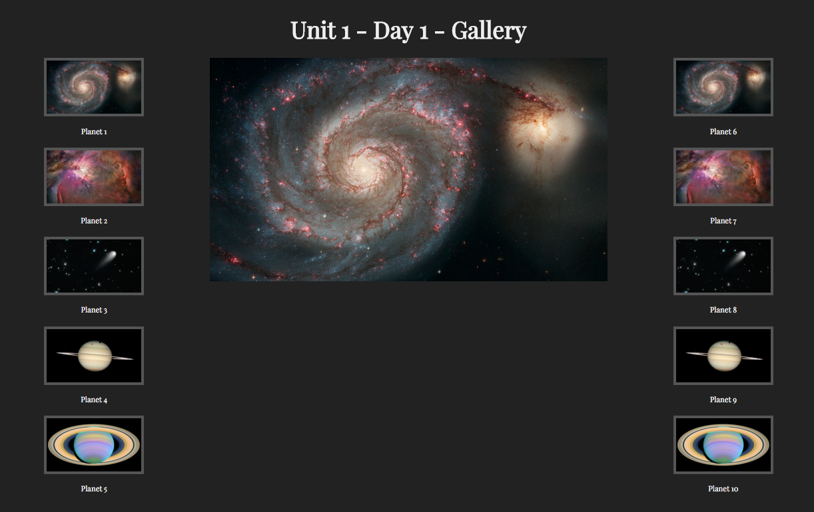

# Image Gallery 

Simple image gallery I created on the first day of my schooling at DigitalCrafts.  There are two columns of thumnails: One on left side of page and one to the right.  In the center there is a large image.  If a user clicks on a thumbnail the center image changes to that image.

